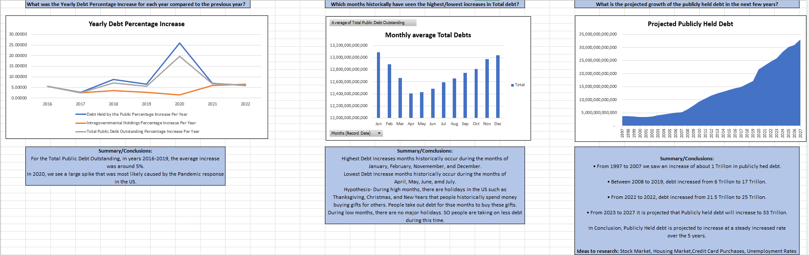

# US Debt Tracker Project (1993–2027)

## 📊 Overview
This Excel-based project analyzes U.S. national debt over time using publicly available Treasury data. The goal was to explore historical trends, evaluate growth patterns, and forecast future debt using Excel functions and visualization tools.

## 🛠 Tools Used
- Microsoft Excel
- Pivot Tables
- Forecast.LINEAR
- Data Cleaning
- Conditional Formatting
- Charting

## 📈 Key Insights
- Publicly held debt increased from **$3.7T in 1997** to over **$25T in 2023**
- The largest yearly increase occurred in **2020** (+19.6%)
- Monthly averages show **January** consistently has the highest debt levels
- Forecasts predict debt could reach **$33T by 2027** under current trends

## 🧠 Final Reflection
This project demonstrates trend analysis, forecasting, and storytelling through data. It serves as a model for applying Excel to real-world datasets in a professional format.

## 📎 Files Included
- `US Debt Tracker Project Final.xlsx` – cleaned data, visuals, forecasts, and final insights

## 🔍 Future Considerations
To expand on this project:
- Analyze correlation between debt and economic factors (e.g., unemployment, interest rates)
- Build a dashboard in Power BI or Tableau
- Convert into a Python notebook for automation

*Above: Summary dashboard of historical debt trends and projections*
